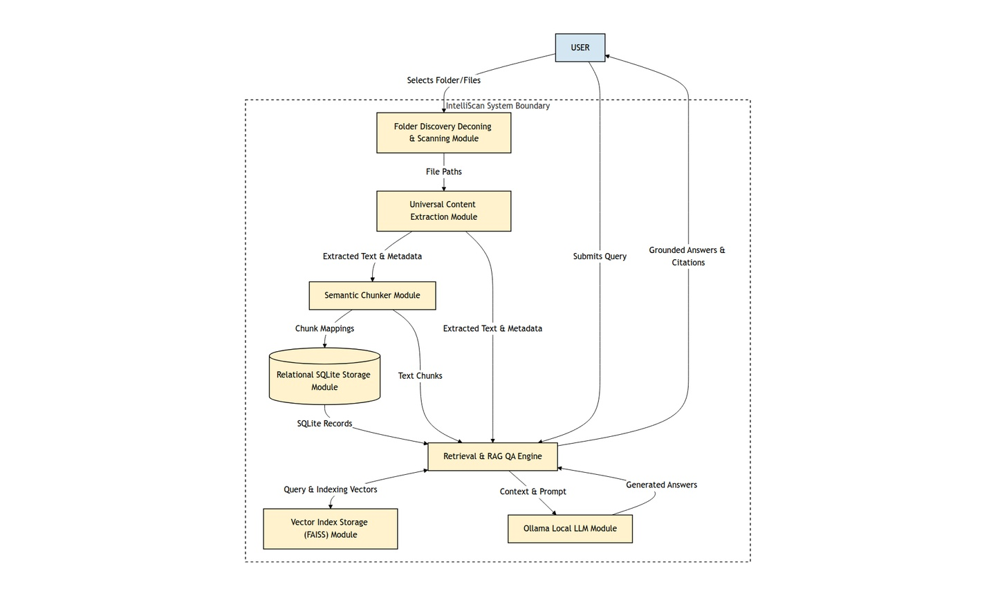
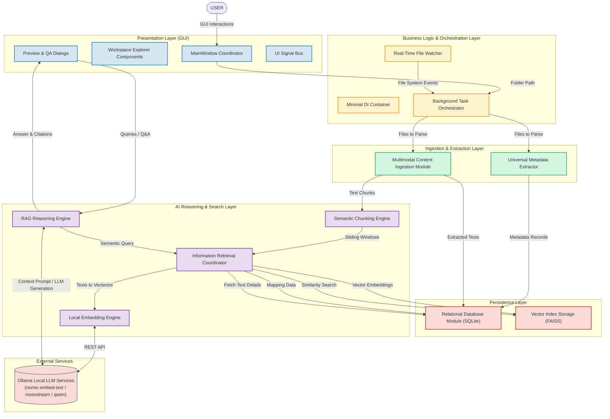
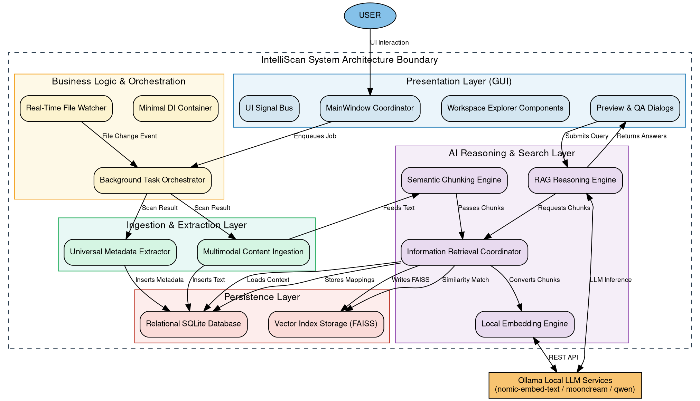

# System Architecture Report: IntelliScan (IntelliVault)

This document presents the high-level system architecture for the **IntelliScan** (internally titled **IntelliVault**) application. Designed to serve as **Section 5 (System Design)** of an MCA project report or IEEE-style dissertation, it accurately represents the *as-implemented* system components, layers, and data flows, ignoring unused modules or temporary files.

---

## 1. Codebase Analysis Summary

A comprehensive scan of the repository reveals a structured PySide6 desktop application integrated with a local relational SQLite database and a local AI subsystem (FAISS vector storage and local LLM services via Ollama). The implementation is organized as follows:

*   **Entry Point:** [`main.py`](file:///home/user/Desktop/mini_project/IntelliScan/main.py) bootstraps the logger, registers shared services in the Dependency Injection container, and starts the Qt Event Loop by rendering the MainWindow.
*   **Dependency Injection:** [`app/container.py`](file:///home/user/Desktop/mini_project/IntelliScan/app/container.py) serves as a minimal Service Locator pattern, lazy-loading heavy engines (Database, FAISS vector index, Task Managers, and RAG Engines) to reduce application startup overhead.
*   **Event Bus:** [`app/signal_bus.py`](file:///home/user/Desktop/mini_project/IntelliScan/app/signal_bus.py) uses Qt Custom Signals to implement a decoupled Observer pattern, routing asynchronous background progress, database updates, and UI notifications.
*   **Ingestion Pipeline:** Files discovered in watched folders are processed in background threads using metadata and content extractors in [`services/`](file:///home/user/Desktop/mini_project/IntelliScan/services) and [`extractors/`](file:///home/user/Desktop/mini_project/IntelliScan/extractors).
*   **Storage Subsystem:** Combines a relational SQLite database (SQLAlchemy models in [`database/models.py`](file:///home/user/Desktop/mini_project/IntelliScan/database/models.py)) with a flat-file serialized FAISS vector index ([`faiss_index.bin`](file:///home/user/Desktop/mini_project/IntelliScan/cache/faiss_index.bin)).
*   **AI Reasoning Subsystem:** Written under [`engines/`](file:///home/user/Desktop/mini_project/IntelliScan/engines), it handles text chunking, batch vectorization, cosine similarity searches, and local RAG orchestration.

---

## 2. Core Execution Pipeline

The operational pipeline flows through five distinct stages:

```
[ INPUT STAGE ]  ──►  [ INGESTION STAGE ]  ──►  [ STORAGE STAGE ]  ──►  [ AI & SEARCH ]  ──►  [ OUTPUT STAGE ]
User GUI Action       Metadata Extractor         SQLite DB Repository      Evidence Chunker       UI Search Panel
File Watcher Event    Multimodal Extractor       FAISS Vector Storage      Ollama Embedding       RAG Answer / Citations
```

1.  **Input:** The user selects a folder to index in the GUI, or the real-time [`FileWatcher`](file:///home/user/Desktop/mini_project/IntelliScan/services/file_watcher.py) detects a file modification.
2.  **Ingestion:** The file path is passed to [`MetadataExtractor`](file:///home/user/Desktop/mini_project/IntelliScan/services/metadata_extractor.py) (extracts system attributes and file checksums) and [`TextExtractor`](file:///home/user/Desktop/mini_project/IntelliScan/services/text_extractor.py) (extracts plain texts and parses multimodal media like OCR captions, audio transcripts, or video keyframes).
3.  **Storage:** Systems metadata, hashes, and full texts are committed to the SQLite database.
4.  **AI & Vectorization:** Extracted text is broken into overlapping windows by [`EvidenceEngine`](file:///home/user/Desktop/mini_project/IntelliScan/engines/evidence_engine.py). Chunks are sent to [`EmbeddingEngine`](file:///home/user/Desktop/mini_project/IntelliScan/engines/embedding_engine.py) (calling local Ollama with Nomic model prefixes) to generate vector embeddings. The resulting vectors are inserted into [`VectorEngine`](file:///home/user/Desktop/mini_project/IntelliScan/engines/vector_engine.py) (FAISS) and saved to disk.
5.  **Output:** When searching or asking questions, the query is embedded, similar chunks are retrieved from FAISS, context is loaded from SQLite, and the LLM constructs an answer displayed on the UI.

---

## 3. High-Level Architectural Layers

To ensure clean separation of concerns, the classes are grouped into five logical layers:

```
┌───────────────────────────────────────────────────────────────────────────┐
│                           PRESENTATION LAYER (GUI)                        │
│     MainWindow  │  Workspace Explorer  │  Preview Panels  │  QA Dialogs    │
└─────────────────────────────────────┬─────────────────────────────────────┘
                                      │ UI Signals & Events
┌─────────────────────────────────────▼─────────────────────────────────────┐
│                     BUSINESS LOGIC & ORCHESTRATION LAYER                  │
│       DI Container  │  Background Task Manager  │  Real-Time Watcher       │
└─────────────────────────────────────┬─────────────────────────────────────┘
                                      │ File Streams & Jobs
┌─────────────────────────────────────▼─────────────────────────────────────┐
│                      INGESTION & DATA EXTRACTION LAYER                    │
│    Universal Metadata Extractor  │  Multimodal Ingestion Module           │
└─────────────────────────────────────┬─────────────────────────────────────┘
                                      │ Extracted Data / Text Blocks
┌─────────────────────────────────────▼─────────────────────────────────────┐
│                            AI & SEARCH LAYER                              │
│  Chunking Engine  │  Embedding Engine  │  Retrieval Engine  │  RAG Engine │
└──────────────────────────┬──────────────────────────┬─────────────────────┘
                           │ SQLite Schema            │ FAISS Index Files
┌──────────────────────────▼──────────────────────────▼─────────────────────┐
│                             PERSISTENCE LAYER                             │
│       Relational DB Module (SQLite)  │  Vector Index Storage (FAISS)      │
└───────────────────────────────────────────────────────────────────────────┘
```

---

## 4. Merged Architectural Modules

To avoid cluttering the system design with low-level class names, the codebase is consolidated into **12 logical modules**:

| Module Name | Component Classes Included | Purpose in System |
| :--- | :--- | :--- |
| **1. UI Coordinator** | `MainWindow`, `StatusBar`, `MenuBar`, `ToolBar` | Central controller for rendering window geometry, status messages, and wiring widget callbacks. |
| **2. Workspace Explorer** | `FolderTree`, `FileExplorer`, `Breadcrumb`, `DrivesWidget`, `FavoritesWidget` | System navigation widgets allowing users to traverse folders and view directory grids. |
| **3. Preview & QA Dialogs** | `PreviewPanel` (extracted text & metadata panels), `IndexedFilesWidget`, `SettingsDialog`, `AskAIDialog` | Displays extracted file text and metadata. Hosts the chat panels for questioning files and searching workspaces. |
| **4. Event & DI Services** | `Container`, `SignalBus` | Lazy-loads heavy singletons (DB connections, models) and routes decoupled events asynchronously. |
| **5. Background Orchestrator** | `TaskManager`, `ThreadManager` | Executes long-running tasks (scanning, OCR, Whisper) in background worker threads to keep the UI responsive. |
| **6. Real-Time File Watcher** | `FileWatcher`, watchdog library | Uses kernel file-system notifications to trigger automatic incremental scans on folder modifications. |
| **7. Metadata Extractor** | `MetadataExtractor` | Resolves MIME types, calculates file sizes, extracts modification times, and computes SHA-256 file checksums. |
| **8. Multimodal Ingestor** | `TextExtractor`, `ImageExtractor`, `AudioExtractor`, `VideoExtractor` | Universal parser that extracts raw text from PDF/Word/Excel and coordinates OCR (Tesseract) and model inference (Whisper/Moondream). |
| **9. Relational Storage** | `Database` (engine), `Repository`, `EngineDBStore`, SQLite schema | Stores relational records (files, metadata, text blocks, evidence chunks) locally via SQLAlchemy ORM. |
| **10. Vector Index Storage** | `VectorEngine` (FAISS index, ID mapping) | Holds structural semantic vector maps in memory, supporting $O(1)$ updates and thread-safe FAISS binary read/write operations. |
| **11. Semantic Chunker** | `EvidenceEngine` | Groups flat text into sliding-window text blocks (overlapping chunks) with accurate location provenance. |
| **12. Retrieval & RAG Engine** | `RetrievalEngine`, `RAGEngine`, `EmbeddingEngine` | Orchestrates query embedding (with prefixes), similarity searching, context generation, and prompt assembly for LLM generation. |

---

## 5. Architectural Visualizations

### High-Level System Architecture Diagram


### A. High-Level Architecture Flow (ASCII)

```
                       ┌─────────────────────────┐
                       │          USER           │
                       └───────────┬─────────────┘
                                   │
                     UI Actions    ▼   Signals / Answers
                       ┌─────────────────────────┐
                       │    Presentation Layer   │
                       │ (GUI, Explorers, QA)    │
                       └───────────┬─────────────┘
                                   │
                    Job Enqueues   ▼   Status updates
                       ┌─────────────────────────┐
                       │  Business Logic Layer   │
                       │   (DI, Task/Threads)    │
                       └───────────┬─────────────┘
                                   │
                   Discovered Path ▼
                       ┌─────────────────────────┐
                       │     Ingestion Layer     │
                       │ (Metadata & Multimodal) │
                       └─────┬─────────────┬─────┘
                             │             │
              Metadata/Texts │             │ Raw Chunks
                             ▼             ▼
  ┌─────────────────────────────┐       ┌─────────────────────────────┐
  │      Persistence Layer      │       │      AI & Search Layer      │
  │     (Relational SQLite)     │◄──────┤ (Chunker, Retrieval, RAG)   │
  └─────────────────────────────┘       └──────────────┬──────────────┘
                                                       │
                                        Embed Chunks   │
                                                       ▼
                                        ┌─────────────────────────────┐
                                        │        Ollama Service       │
                                        │   (Local Embeddings & LLM)  │
                                        └─────────────────────────────┘
```

---

### B. Mermaid Flowchart

This diagram illustrates the detailed data propagation path from raw file ingestion to vector extraction and query resolution:



---

### C. Graphviz DOT Specification

For compiling vectors inside LaTeX or displaying high-resolution PDF layouts, use this Graphviz representation:



---

## 6. Module Specifications

This section describes the detailed contracts of the architectural modules.

### Module 1: UI Coordinator
*   **Purpose:** Builds the application's mainframe, manages global state transitions, coordinates child docks/widgets, and binds user input callbacks to core logic operations.
*   **Inputs:** User mouse and keyboard actions, SignalBus events.
*   **Outputs:** Refreshed UI frames, status messages.
*   **Dependencies:** `Workspace Explorer`, `Preview & QA Dialogs`, `Event & DI Services`.

### Module 5: Background Orchestrator
*   **Purpose:** Prevents freezing of the GUI event loop. Manages a thread pool that runs extraction tasks and file scans asynchronously, reporting task updates back via QSignals.
*   **Inputs:** Folder paths, file paths, raw files.
*   **Outputs:** Progress updates, success/failure statuses.
*   **Dependencies:** `Event & DI Services`, `Metadata Extractor`, `Multimodal Ingestor`.

### Module 8: Multimodal Ingestor
*   **Purpose:** Identifies MIME types and executes file parsers recursively. Coordinates local Tesseract OCR, Whisper, and Moondream REST endpoints to extract texts and captions from files (including complex audio, video, and image keyframes).
*   **Inputs:** Absolute file paths, binary files.
*   **Outputs:** Structural strings of text, visual frame captions, and audio timestamps.
*   **Dependencies:** `Event & DI Services`, `Local Embedding Engine` (Ollama connection).

### Module 9: Relational Storage
*   **Purpose:** Houses all indexable file history, metadata attributes, extracted texts, and evidence chunk hashes in a local, relational SQLite database, utilizing SQLAlchemy to abstract SQL transactions.
*   **Inputs:** Metadata records, extracted texts, chunks.
*   **Outputs:** Persisted database objects, filtered SQL query results.
*   **Dependencies:** `Event & DI Services`.

### Module 10: Vector Index Storage
*   **Purpose:** Manages a thread-safe FAISS vector database. Generates flat index matrices, performs cosine similarity searches on embeddings, and persists indices to disk.
*   **Inputs:** Embedding vectors, chunk IDs.
*   **Outputs:** Ordered lists of nearest-neighbor chunk IDs and similarity scores.
*   **Dependencies:** `Event & DI Services`, external `faiss` library.

### Module 12: Retrieval & RAG Engine
*   **Purpose:** Resolves questions and search requests. Performs semantic similarity matching, loads SQL text context, structures local prompts, and interfaces with local LLMs to generate answers with precise sources.
*   **Inputs:** Natural language queries, context scoping options (file/workspace filters).
*   **Outputs:** Answers, list of citations (page, timestamp, or snippet).
*   **Dependencies:** `Local Embedding Engine`, `Vector Index Storage`, `Relational Storage`.

---

## 7. Architectural Rationale and Correctness

### A. Loose Coupling via the Event Bus and DI
Desktop UI development often suffers from tight coupling where views directly import engine singletons. IntelliScan resolves this using a **Dependency Injection (DI) Container** as a service locator. Widgets request services (like `container.db` or `container.rag_engine`) dynamically.
Furthermore, asynchronous tasks communicate exclusively via PySide6 signals routed through the `SignalBus`. This prevents background workers from directly modifying UI components, avoiding segmentation faults and thread-safety violations.

### B. Correctness of the Extraction and Embedding Pipeline
The ingestion pipeline enforces strict chronological order:
1.  A file's metadata and SHA-256 hash are calculated *first*. If the hash matches an existing record in SQLite, the system skips reading the file, preventing redundant disk reads and hashing operations.
2.  Text content extraction only occurs on new or modified files.
3.  Extracted text is sent to the `EvidenceEngine` *before* the vector engine is called, allowing the system to construct structural `EvidenceChunks` with file paths, labels, and character ranges.
4.  The `RetrievalEngine` batches embedding generation, prepending model-specific tags (like `search_document: `) to the texts. This ensures embeddings map correctly to the FAISS vector index alongside their relational mappings in SQLite.

---

## 8. Academic Diagram Recommendation

When presenting these diagrams in your MCA project report or academic papers, select the format that best fits the target audience:

*   **For the MCA Project Report (Figure 5.1):** Use the **Mermaid Flowchart** or compile the **Graphviz DOT** version into a high-resolution PNG. The color-coded boxes clearly represent the layered architecture required by academic project examiners.
*   **For an IEEE-style Dissertation / Conference Paper:** The **Graphviz DOT** compiled in grayscale (using standard IEEE formatting guidelines) is recommended. It produces clear vector SVG/PDF diagrams suitable for double-column publication.
*   **For System Design Chapters:** The **High-Level Architecture Flow (ASCII)** provides a clean summary of the system layers, serving as an introductory diagram before diving into detailed module specifications.

---

## 9. Appendix: Relational Database Schema

The SQLite database (`intellivault.db`) contains the following primary schemas mapped by SQLAlchemy models:

*   **`files` Table:** Manages basic file assets indexed in the workspace.
    - `id` (Integer, Primary Key)
    - `path` (String, Unique Index): Absolute path to the file.
    - `name` (String): Filename.
    - `parent` (String, Index): Directory parent path.
    - `size` (Integer): File size in bytes.
    - `mime` (String): MIME type.
    - `modified` (DateTime): Last modification timestamp.
    - `checksum` (String): SHA-256 content checksum.

*   **`ai_analysis` Table:** Stores AI-generated analysis results based on file hash.
    - `id` (Integer, Primary Key)
    - `file_hash` (String(64), Unique Index): SHA-256 content checksum.
    - `summary` (Text): AI-generated content summary.
    - `keywords` (Text): JSON array of keywords.
    - `tags` (Text): JSON array of tags.
    - `category` (String): Categorization label.
    - `language` (String): Document language.
    - `generated_time` (DateTime): Timestamp of generation.

*   **`evidence` Table:** Manages text chunks extracted for Retrieval-Augmented Generation (RAG).
    - `id` (Integer, Primary Key)
    - `chunk_id` (String(32), Unique Index): MD5/SHA-256 hash identifying the chunk.
    - `file_path` (String, Index): Absolute path of source file.
    - `file_hash` (String(64), Index): SHA-256 content checksum of source file.
    - `text` (Text): Raw text chunk content.
    - `source_type` (String): Type of block (e.g., slide, section, page).
    - `source_label` (String): Provenance label (e.g., "Section 1").
    - `char_start` (Integer): Index of the first character in source file.
    - `char_end` (Integer): Index of the last character in source file.

*   **`vector_map` Table:** Links FAISS vector indices to SQLite database chunks.
    - `id` (Integer, Primary Key)
    - `chunk_id` (String(32), Unique Index): Unique chunk identifier.
    - `file_path` (String, Index): Source file path.
    - `embedding_model` (String): Model used (e.g., `nomic-embed-text`).
